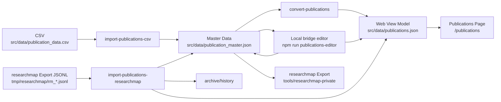

# 出版物データの管理

このドキュメントでは、`my-web-page` における出版物データの正本、ローカル editor、生成物、researchmap 連携をまとめます。

## 正本と生成物

- 正本は `src/data/publication_master.json` です
- `src/data/publications.json` は Web 表示用の生成物です
- `src/data/publication_data.csv` は移行・再取り込み用の入力です

日常運用では `publication_master.json` を編集し、`publications.json` はそこから再生成します。CSV を正本として扱わないでください。researchmap で修正した内容を戻す場合は、CSV ではなく researchmap export JSONL から `publication_master.json` に取り込みます。

この repo では、正規化したタイトルが一致する業績の重複を許容しません。同一タイトルの業績を別 record として追加せず、既存 record を更新する前提で運用します。

## 更新ワークフロー

### ローカル editor で編集する場合

1. bridge 付き editor を起動します

   ```bash
   npm run publications-editor
   ```

2. 表示された `http://127.0.0.1:4318` をブラウザで開きます
3. 業績を編集して `Save` を実行します
4. bridge が次をまとめて行います
   - `publication_master.json` の検証
   - `publication_master.json` の保存
   - `publications.json` の再生成
5. `http://localhost:3000/publications` で表示確認します

editor は公開用 SPA とは別 entrypoint です。公開サイトの route には含めません。

### `publication_master.json` を直接編集する場合

1. `src/data/publication_master.json` を編集します
2. 以下を実行して Web 表示用 JSON を再生成します

   ```bash
   npm run convert-publications
   ```

3. `http://localhost:3000/publications` で表示確認します

### CSV から初期化・再取り込みする場合

1. 最新の CSV を `src/data/publication_data.csv` に配置します
2. 以下を実行して master data を再生成します

   ```bash
   npm run import-publications-csv
   npm run convert-publications
   ```

3. `src/data/publication_master.json` と `src/data/publications.json` の内容を確認します

CSV は移行・再取り込み専用です。日常更新の入口に戻さないでください。

### researchmap export JSONL を取り込む場合

1. researchmap から取得した `rm_*.jsonl` を `tmp/researchmap/` など任意の作業ディレクトリへ置きます
2. まず dry-run で更新件数・追加件数・`review`・`invalid` を確認します

   ```bash
   npm run import-publications-researchmap -- --input tmp/researchmap/rm_researchersYYYYMMDD.jsonl --dry-run
   ```

3. 問題なければ本実行します

   ```bash
   npm run import-publications-researchmap -- --input tmp/researchmap/rm_researchersYYYYMMDD.jsonl
   ```

4. CLI が次をまとめて行います
   - `published_papers` / `presentations` / `misc` だけを取り込みます
   - 自動 merge は `researchmap record id -> DOI -> canonical fingerprint` の strict match だけを通します
   - title だけ近い record や core field 競合は `review` に回します
   - 一致した業績では canonical `fields` を更新し、`localMeta` は保持します
   - `sync.researchmap` は import 成功した record だけ更新します
   - JSONL にしかない業績は新規追加します
   - `publication_master.json` と `publications.json` をまとめて更新します
   - 正常終了した JSONL を `archive/` へ移動し、同じ内容の再取り込みを履歴で防止します

`review`、invalid record、またはタイトル重複が 1 件でもある場合、本実行は `publication_master.json` を書き換えません。レポートを見て入力か master を整理してから再実行してください。

## データフロー



## master data の構造

各業績は次の 3 層で保持します。

- `fields`
  - canonical schema の正本です
  - `type` / `subtype` / `title` / `contributors[]` / `venue` / `dates` / `identifiers` / `links` / `bibliographic` / `isInternational` などを保持します
- `localMeta`
  - `hasEmptyFields`
  - `notes`
  - `notes` は editor / ローカル運用用の補助情報として保持し、researchmap import/export の自動判定には使いません
- `sync.researchmap`
  - `recordId` / `userId` / `lastImportedAt` / `lastPayloadHash`
  - researchmap との同一性判定と追跡に使います

例:

```json
{
  "id": "pub-2023-optical-review",
  "fields": {
    "type": "published_papers",
    "subtype": "scientific_journal",
    "title": {
      "en": "Numerical simulations on optoelectronic deep neural network hardware based on self-referential holography"
    },
    "contributors": [
      {
        "role": "author",
        "name": { "en": "Rio Tomioka" }
      }
    ],
    "venue": {
      "kind": "publication",
      "name": { "en": "Optical Review" }
    },
    "dates": {
      "published": "2023-04-28"
    },
    "identifiers": {
      "doi": "10.1007/s10043-023-00810-2"
    }
  },
  "localMeta": {
    "hasEmptyFields": false,
    "notes": ""
  },
  "sync": {
    "researchmap": {
      "recordId": "53373093"
    }
  }
}
```

## 生成スクリプト

### `npm run convert-publications`

- 入力: `src/data/publication_master.json`
- 出力: `src/data/publications.json`

Web 表示用 JSON だけを再生成します。master data は上書きしません。

### `npm run import-publications-csv`

- 入力: `src/data/publication_data.csv`
- 出力: `src/data/publication_master.json`

CSV から master data を再構築する移行用スクリプトです。

### `npm run import-publications-researchmap -- --input <rm_jsonl>`

- 入力: researchmap export の `rm_*.jsonl`
- 出力:
  - `src/data/publication_master.json`
  - `src/data/publications.json`
- 付随処理:
  - dry-run で更新件数・追加件数・曖昧一致・invalid を確認
  - タイトル重複があれば hard error で停止
  - 正常終了した JSONL を `archive/` へ移動
  - 同じ内容の再取り込みを履歴で防止

researchmap 上で更新した書誌情報を `publication_master.json` に安全にマージする通常運用の入口です。

## Web 表示モデル

`publications.json` は旧来ラベルに戻さず、researchmap に近い分類コードを持つようにしています。

- `type`: `published_papers/scientific_journal` のような分類キー
- `category`: `published_papers` / `presentations` / `misc`
- `subtype`: researchmap の subtype 相当
- `review`: `peer_reviewed` / `not_peer_reviewed`
- `authorship`: `lead` `corresponding` `last` `coauthor`
- `presentationType`: `oral_presentation` など
- `name` / `japanese` / `webLink` / `others` も canonical `fields` 側から組み立てます
- `hasEmptyFields` は master のみに保持し、`publications.json` には出しません

表示ラベルへの変換は React 側で行います。

## researchmap への出力

`tools/researchmap-private` の正規入力は `publication_master.json` の canonical `fields` です。表示用モデルや CSV を経由せず、adapter が researchmap payload を直接構築します。

```bash
cd tools/researchmap-private
node scripts/exportResearchmapJson.mjs \
  --input ../../src/data/publication_master.json \
  --output-dir ../../tmp/researchmap \
  --researchmap-user-id R000000000
```

既存の researchmap エクスポートをベースに安全に再投入する場合:

```bash
cd tools/researchmap-private
node scripts/exportResearchmapJson.mjs \
  --input ../../src/data/publication_master.json \
  --output-dir ../../tmp/researchmap \
  --researchmap-user-id R000000000 \
  --existing-jsonl ../../tmp/researchmap/rm_researchersYYYYMMDD.jsonl
```

## 表示確認

`publications.json` を更新したあとに `http://localhost:3000/publications` を開き、以下を確認します。

- 新しい業績が表示されている
- フィルターが動作する
- 時系列順と種類順の切り替えが動作する
- DOI / URL / 要旨の表示が崩れていない

## 注意点

- `publication_master.json` が唯一の正本です
- `publications-editor` はローカル専用です。公開用アプリへ route を足さないでください
- CSV は移行・再取り込み用です。日常運用で正本に戻さないでください
- `git status` で意図しない差分が混ざっていないか確認してから commit / push してください
- `scripts/convertPublications.ts` のテストは `src/data/publication_master.json` と `src/data/publications.json` を一時的に退避・復元します
