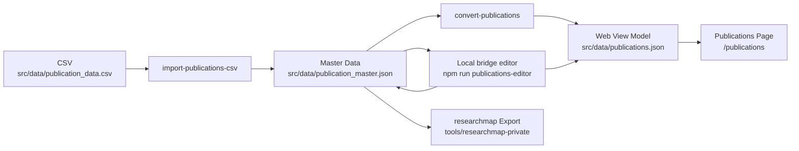

# 出版物データの管理

このドキュメントでは、`my-web-page` における出版物データの正本、ローカル editor、生成物、researchmap 連携をまとめます。

## 正本と生成物

- 正本は `src/data/publication_master.json` です
- `src/data/publications.json` は Web 表示用の生成物です
- `src/data/publication_data.csv` は移行・再取り込み用の入力です

日常運用では `publication_master.json` を編集し、`publications.json` はそこから再生成します。CSV を正本として扱わないでください。

## 更新ワークフロー

### ローカル editor で編集する場合

1. bridge 付き editor を起動します

   ```bash
   npm run publications-editor
   ```

2. 表示された `http://127.0.0.1:4318` をブラウザで開きます
3. 業績を編集して `Save` を実行します
4. bridge が次をまとめて行います
   - `publication_master.json` の検証
   - `publication_master.json` の保存
   - `publications.json` の再生成
5. `http://localhost:3000/publications` で表示確認します

editor は公開用 SPA とは別 entrypoint です。公開サイトの route には含めません。

### `publication_master.json` を直接編集する場合

1. `src/data/publication_master.json` を編集します
2. 以下を実行して Web 表示用 JSON を再生成します

   ```bash
   npm run convert-publications
   ```

3. `http://localhost:3000/publications` で表示確認します

### CSV から初期化・再取り込みする場合

1. 最新の CSV を `src/data/publication_data.csv` に配置します
2. 以下を実行して master data を再生成します

   ```bash
   npm run import-publications-csv
   npm run convert-publications
   ```

3. `src/data/publication_master.json` と `src/data/publications.json` の内容を確認します

CSV は移行・再取り込み専用です。日常更新の入口に戻さないでください。

## データフロー



## master data の構造

各業績は次の 2 層で保持します。

- `researchmapFields`
  - researchmap に寄せた型、タイトル、著者、誌名・会議名、日付、DOI、URL、巻号ページ、要旨など
- `localMeta`
  - `hasEmptyFields`
  - `rawCitation`
  - `notes`
  - `rawCitation` と `notes` は editor / ローカル運用用の補助情報として保持し、`publications.json` へはそのまま投影しません

例:

```json
{
  "id": "pub-2023-optical-review",
  "researchmapFields": {
    "type": "published_papers",
    "subtype": "scientific_journal",
    "published_paper_type": "scientific_journal",
    "paper_title": {
      "en": "Numerical simulations on optoelectronic deep neural network hardware based on self-referential holography"
    },
    "authors": {
      "en": [{ "name": "Rio Tomioka" }]
    },
    "publication_name": {
      "en": "Optical Review"
    },
    "publication_date": "2023-04-28",
    "identifiers": {
      "doi": ["10.1007/s10043-023-00810-2"]
    }
  },
  "localMeta": {
    "hasEmptyFields": false,
    "rawCitation": {
      "en": "Rio Tomioka and Masanori Takabayashi, ..."
    },
    "notes": ""
  }
}
```

## 生成スクリプト

### `npm run convert-publications`

- 入力: `src/data/publication_master.json`
- 出力: `src/data/publications.json`

Web 表示用 JSON だけを再生成します。master data は上書きしません。

### `npm run import-publications-csv`

- 入力: `src/data/publication_data.csv`
- 出力: `src/data/publication_master.json`

CSV から master data を再構築する移行用スクリプトです。

## Web 表示モデル

`publications.json` は旧来ラベルに戻さず、researchmap に近い分類コードを持つようにしています。

- `type`: `published_papers/scientific_journal` のような分類キー
- `category`: `published_papers` / `presentations` / `misc`
- `subtype`: researchmap の subtype 相当
- `review`: `peer_reviewed` / `not_peer_reviewed`
- `authorship`: `lead` `corresponding` `last` `coauthor`
- `presentationType`: `oral_presentation` など
- `name` / `japanese` / `webLink` / `others` も `researchmapFields` 側から組み立て、`localMeta.rawCitation` / `localMeta.notes` をそのまま公開用 JSON に流しません

表示ラベルへの変換は React 側で行います。

## researchmap への出力

`tools/researchmap-private` は `publication_master.json` を直接入力にできます。

```bash
cd tools/researchmap-private
node scripts/exportResearchmapJson.mjs \
  --input ../../src/data/publication_master.json \
  --output-dir ../../tmp/researchmap \
  --researchmap-user-id R000000000
```

既存の researchmap エクスポートをベースに安全に再投入する場合:

```bash
cd tools/researchmap-private
node scripts/exportResearchmapJson.mjs \
  --input ../../src/data/publication_master.json \
  --output-dir ../../tmp/researchmap \
  --researchmap-user-id R000000000 \
  --existing-jsonl ../../tmp/researchmap/rm_researchersYYYYMMDD.jsonl
```

## 表示確認

`publications.json` を更新したあとに `http://localhost:3000/publications` を開き、以下を確認します。

- 新しい業績が表示されている
- フィルターが動作する
- 時系列順と種類順の切り替えが動作する
- DOI / URL / 要旨の表示が崩れていない

## 注意点

- `publication_master.json` が唯一の正本です
- `publications-editor` はローカル専用です。公開用アプリへ route を足さないでください
- CSV は移行・再取り込み用です。日常運用で正本に戻さないでください
- `git status` で意図しない差分が混ざっていないか確認してから commit / push してください
- `scripts/convertPublications.ts` のテストは `src/data/publication_master.json` と `src/data/publications.json` を一時的に退避・復元します
