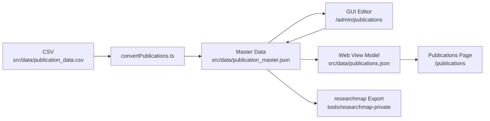

# 出版物データの管理

このドキュメントでは、`my-web-page` における出版物データの正本、再生成フロー、ローカル GUI 編集、researchmap 連携をまとめます。

## いまの正本

- 正本は `src/data/publication_master.json` です
- `src/data/publications.json` は Web 表示用の生成物です
- `src/data/publication_data.csv` は移行・再取り込み用の入力です

日常運用では `publication_master.json` を編集し、その後に `npm run convert-publications` を実行して生成物を同期します。

## 更新ワークフロー

### CSV から初期化・再取り込みする場合

1. 最新の CSV を `src/data/publication_data.csv` に配置します
2. 以下を実行します

   ```bash
   npm run convert-publications
   ```

3. `src/data/publication_master.json` と `src/data/publications.json` が更新されます

### ローカル GUI で編集する場合

1. 開発サーバーを起動します

   ```bash
   npm start
   ```

2. `http://localhost:3000/admin/publications` を開きます
3. `master JSON を開く` から `src/data/publication_master.json` を選択します
4. 編集して `JSON に保存` を実行します
5. 保存後に以下を実行します

   ```bash
   npm run convert-publications
   ```

6. `http://localhost:3000/publications` で表示確認します

GUI はローカル開発時のみ有効です。保存には File System Access API を使うため、対応ブラウザで開いてください。

## データフロー



## master data の構造

各業績は次の 2 層で保持します。

- `researchmapFields`
  - researchmap に寄せた型・タイトル・著者・誌名/会議名・日付・DOI・URL・巻号ページ・要旨など
- `localMeta`
  - `hasEmptyFields`
  - `rawCitation`
  - `notes`
  - `legacyHints`

`legacyHints` は現行 Web 表示との互換のために一時的に持っている補助情報です。表示側を完全に researchmap 準拠へ寄せ切るまで、著者役割と発表形式をここで保持します。

例:

```json
{
  "id": "pub-2023-optical-review",
  "researchmapFields": {
    "type": "published_papers",
    "subtype": "scientific_journal",
    "paper_title": {
      "en": "Numerical simulations on optoelectronic deep neural network hardware based on self-referential holography"
    },
    "authors": {
      "en": [{ "name": "Rio Tomioka" }]
    },
    "publication_name": {
      "en": "Optical Review"
    },
    "publication_date": "2023-04-28",
    "identifiers": {
      "doi": ["10.1007/s10043-023-00810-2"]
    }
  },
  "localMeta": {
    "hasEmptyFields": false,
    "rawCitation": {
      "en": "Rio Tomioka and Masanori Takabayashi, ..."
    },
    "notes": "",
    "legacyHints": {
      "authorship": ["Lead author", "Corresponding author"],
      "presentationType": ["Oral"]
    }
  }
}
```

## 生成スクリプト

`npm run convert-publications` は次をまとめて行います。

1. CSV を読み込みます
2. `publication_master.json` を生成します
3. master data から `publications.json` を生成します

出力先:

- `src/data/publication_master.json`
- `src/data/publications.json`

## researchmap への出力

`tools/researchmap-private` は `publication_master.json` を直接入力にできます。

```bash
cd tools/researchmap-private
node scripts/exportResearchmapJson.mjs \
  --input ../../src/data/publication_master.json \
  --output-dir ../../tmp/researchmap \
  --researchmap-user-id R000000000
```

既存の researchmap エクスポートをベースに安全に再投入する場合:

```bash
cd tools/researchmap-private
node scripts/exportResearchmapJson.mjs \
  --input ../../src/data/publication_master.json \
  --output-dir ../../tmp/researchmap \
  --researchmap-user-id R000000000 \
  --existing-jsonl ../../tmp/researchmap/rm_researchersYYYYMMDD.jsonl
```

確認ポイント:

- `tmp/researchmap/manual-review.json` に想定外の要確認項目がない
- `tmp/researchmap/merge-review.json` の `typeMismatches` が空
- `tmp/researchmap/import.jsonl` を投入後、巻号・ページ・URL が意図どおり反映される

## 表示確認

`npm run convert-publications` のあとに `http://localhost:3000/publications` を開き、以下を確認します。

- 新しい業績が表示されている
- フィルターが動作する
- 時系列順と種類順の切り替えが動作する
- DOI / URL / 要旨の表示が崩れていない

## 注意点

- `publication_master.json` を編集したら、必ず `npm run convert-publications` を実行して生成物を同期してください
- CSV は移行・再取り込み用です。日常運用では `publication_master.json` を優先します
- `publication_data.csv` を人手で直接メンテナンスする前提には戻さないでください
- `git status` で意図しない差分が混ざっていないか確認してから commit / push してください
- `scripts/convertPublications.ts` のテストは `src/data/publication_master.json` と `src/data/publications.json` を一時的に上書きします
