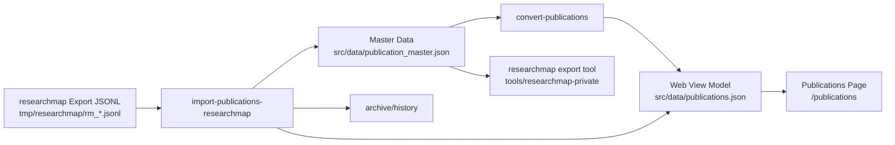

# 出版物データの管理

このドキュメントでは、`my-web-page` における出版物データの正本、再生成物、researchmap 連携の通常運用をまとめます。

## 正本と生成物

- 正本は `src/data/publication_master.json` です
- `src/data/publications.json` は Web 表示用の生成物です
- 日常運用では researchmap export JSONL を取り込み、`publications.json` はそこから再生成します

この repo では、正規化したタイトルが一致する業績の重複を許容しません。同一タイトルの業績を別 record として追加せず、既存 record を更新する前提で運用します。

## researchmap 登録区分の基準

researchmap から取り込むときも、Web 側の master data から researchmap へ戻すときも、次の基準で 1 件の業績を 1 record に寄せます。researchmap 側に複数の置き場所がありそうな場合でも、同一内容を 2 件に分けて登録せず、この基準で主たる区分を選びます。

| 業績の性質 | `fields.type` | 補足 |
| --- | --- | --- |
| 査読付き学術誌論文 | `published_papers` | `fields.review: true` を保持し、subtype は `scientific_journal` など researchmap の論文種別に合わせます |
| 査読ありの国際会議プロシーディング | `published_papers` | 現所属で論文として扱うのが妥当なものは、`international_conference_proceedings` などの subtype で論文区分に寄せます |
| 上記以外で原稿がある業績 | `misc` | 研究会予稿、技術報告、解説、国内会議の概要原稿など、論文区分に置かない原稿付き業績をまとめます |
| 原稿がなく、学術会議や研究会で発表のみ行った業績 | `presentations` | 口頭発表、ポスター発表、招待講演などの発表実績として扱います |

「論文として扱うのが妥当なもの」は、現所属の業績分類や評価単位に合わせて判断します。過去の所属やイベント側の呼称だけで二重登録せず、Web と researchmap の両方で同じ 1 record を追跡できる状態を優先します。

researchmap の区分に該当欄がない情報は、Web 側 master の `fields` に構造化して保持します。たとえば `review`、`isInternational`、`ownerRoles`、`description`、`location`、`links`、`bibliographic` などは、Web 表示や再生成で使える canonical field として残します。researchmap へ戻すときは、researchmap の payload に対応する欄があるものは typed field へ写し、対応欄がない補足は可能な範囲で `description` などの概要にまとめます。

この方針整理では、既存の `publication_master.json` と `publications.json` は更新しません。既存データを一括で再分類すると表示順、filter、researchmap record id との対応に影響するため、今後の researchmap export JSONL 取り込みや個別の業績整理で、dry-run の `review` を確認しながら 1 record ずつ方針に合わせます。

## 公開/非公開の境界

- `src/data/publication_master.json`
  - canonical な publication data の tracked 正本です
  - `fields` は公開して問題ない書誌情報として扱います
  - `sync.researchmap` は連携メタですが、現時点では機密情報としては扱わず tracked data に残します
  - つまり `sync.researchmap` は private 側へ分離する対象ではなく、この repo では public 側の tracked metadata として扱います
- `src/data/publications.json`
  - 公開ページ用の生成物です
  - `localMeta.notes`、`hasEmptyFields`、`sync.researchmap.*` は出力しません
- local-only のまま運用するもの
  - `tmp/researchmap/**` の import/export 入出力
  - `tmp/researchmap/archive/**` と再取り込み防止の履歴
  - dry-run で出る review / invalid / quarantine 相当の一時レポート
  - 将来 unpublished note が必要になった場合のローカル補助メモ

つまり、この repo では `tmp/researchmap` / `archive` / review / quarantine / ローカル運用メモだけを local-only として扱います。`publication_master.json` に含まれる `fields` と `sync.researchmap` は public 側の tracked data として扱い、`tools/researchmap-private` は repo 内の通常ツールです。

## 更新ワークフロー

### researchmap export JSONL を取り込む場合

1. researchmap から取得した `rm_*.jsonl` を `tmp/researchmap/` など任意の作業ディレクトリへ置きます
2. まず dry-run で更新件数・追加件数・`review`・`invalid` を確認します

   ```bash
   npm run import-publications-researchmap -- --input tmp/researchmap/rm_researchersYYYYMMDD.jsonl --dry-run
   ```

3. 問題なければ本実行します

   ```bash
   npm run import-publications-researchmap -- --input tmp/researchmap/rm_researchersYYYYMMDD.jsonl
   ```

4. CLI が次をまとめて行います
   - `published_papers` / `presentations` / `misc` だけを取り込みます
   - 自動 merge は `researchmap record id -> DOI -> canonical fingerprint` の strict match だけを通します
   - title だけ近い record や core field 競合は `review` に回します
   - 一致した業績では canonical `fields` を更新し、`localMeta` は保持します
   - `sync.researchmap` は import 成功した record だけ更新します
   - JSONL にしかない業績は新規追加します
   - `publication_master.json` と `publications.json` をまとめて更新します
   - 正常終了した JSONL を `archive/` へ移動し、同じ内容の再取り込みは履歴で防止します

`review`、invalid record、またはタイトル重複が 1 件でもある場合、本実行は `publication_master.json` を書き換えません。レポートを見て入力か master を整理してから再実行してください。

## データフロー



## 本線と補助

- 通常運用の本線は `researchmap export JSONL -> publication_master.json -> publications.json` で、公開側の tracked data 更新はここで完結します
- 逆向きの `publication_master.json -> researchmap` は、researchmap へ安全に再投入したいときだけ使う補助ツールです
- `researchmapMerge` / `researchmapReversibleExport` / `researchmapConsistency` は、既存 researchmap 側の情報を壊しにくくし、生成結果の由来や整合を確認するための補助です
- 過去の `researchmapFields` 形式は移行済みの legacy schema です。現行ツールの入力は canonical `fields` を持つ `publication_master.json` だけに統一します
- local-only に残すのは `tmp/researchmap/**`、review / quarantine / archive の生成物、将来のローカル補助メモで、`publication_master.json` 自体は public 側の tracked canonical data として扱います

## master data の構造

各業績は次の 3 層で保持します。

- `fields`
  - canonical schema の正本です
  - `type` / `subtype` / `title` / `contributors[]` / `venue` / `dates` / `identifiers` / `links` / `bibliographic` / `isInternational` などを保持します
- `localMeta`
  - `hasEmptyFields`
  - `notes`
  - `notes` はローカル運用用の補助情報として保持し、researchmap import/export の自動判定には使いません
- `sync.researchmap`
  - `recordId` / `userId` / `lastImportedAt` / `lastPayloadHash`
  - researchmap との同一性判定と追跡に使います

例:

```json
{
  "id": "pub-2023-optical-review",
  "fields": {
    "type": "published_papers",
    "subtype": "scientific_journal",
    "title": {
      "en": "Numerical simulations on optoelectronic deep neural network hardware based on self-referential holography"
    },
    "contributors": [
      {
        "role": "author",
        "name": { "en": "Rio Tomioka" }
      }
    ],
    "venue": {
      "kind": "publication",
      "name": { "en": "Optical Review" }
    },
    "dates": {
      "published": "2023-04-28"
    },
    "identifiers": {
      "doi": "10.1007/s10043-023-00810-2"
    }
  },
  "localMeta": {
    "hasEmptyFields": false,
    "notes": ""
  },
  "sync": {
    "researchmap": {
      "recordId": "53373093"
    }
  }
}
```

## 生成スクリプト

### `npm run convert-publications`

- 入力: `src/data/publication_master.json`
- 出力: `src/data/publications.json`

Web 表示用 JSON だけを再生成します。master data は上書きしません。

### `npm run import-publications-researchmap -- --input <rm_jsonl>`

- 入力: researchmap export の `rm_*.jsonl`
- 出力:
  - `src/data/publication_master.json`
  - `src/data/publications.json`
- 付随処理:
  - dry-run で更新件数・追加件数・曖昧一致・invalid を確認
  - タイトル重複があれば hard error で停止
  - 正常終了した JSONL を `archive/` へ移動
  - 同じ内容の再取り込みを履歴で防止

researchmap 上で更新した書誌情報を `publication_master.json` に安全にマージする通常運用の入口です。`publication_master.json` を日常的に直接編集する導線は用意しません。

## Web 表示モデル

`publications.json` は旧来ラベルに戻さず、researchmap に近い分類コードを持つようにしています。

- `type`: `published_papers/scientific_journal` のような分類キー
- `category`: `published_papers` / `presentations` / `misc`
- `subtype`: researchmap の subtype 相当
- `review`: `peer_reviewed` / `not_peer_reviewed`
- `authorship`: `lead` `corresponding` `last` `coauthor`
- 査読付き学術誌と査読あり国際会議プロシーディングは `category: "published_papers"` として表示されます
- 原稿があるが論文区分に置かない業績は `category: "misc"`、発表のみの業績は `category: "presentations"` として表示されます
- 研究発表が口頭発表かポスターかは、独立フィールドではなく `type` の `presentations/oral_presentation` / `presentations/poster_presentation` と `subtype` で表します
- `name` / `japanese` / `webLink` / `others` も canonical `fields` 側から組み立てます
- `hasEmptyFields` は master のみに保持し、`publications.json` には出しません

表示ラベルへの変換は React 側で行います。

## researchmap への出力

`tools/researchmap-private` は repo 内の通常ツールで、正規入力は `publication_master.json` の canonical `fields` です。表示用モデルを経由せず、adapter が researchmap payload を直接構築します。

export adapter は `fields.type` に応じて、`published_paper_type`、`misc_type`、`presentation_type` のいずれかへ subtype を写します。共通の補足情報は `description`、査読有無は `referee`、国際性は researchmap payload の該当 field へ変換します。researchmap に個別欄がない補足は、master 側の構造化 field を正本として残し、必要に応じて概要文へ集約してから戻します。

```bash
cd tools/researchmap-private
node scripts/exportResearchmapJson.mjs \
  --input ../../src/data/publication_master.json \
  --output-dir ../../tmp/researchmap \
  --researchmap-user-id R000000000
```

既存の researchmap エクスポートをベースに安全に再投入する場合:

```bash
cd tools/researchmap-private
node scripts/exportResearchmapJson.mjs \
  --input ../../src/data/publication_master.json \
  --output-dir ../../tmp/researchmap \
  --researchmap-user-id R000000000 \
  --existing-jsonl ../../tmp/researchmap/rm_researchersYYYYMMDD.jsonl
```

## 表示確認

`publications.json` を更新したあとに `http://localhost:3000/publications` を開き、以下を確認します。

- 新しい業績が表示されている
- フィルターが動作する
- 時系列順と種類順の切り替えが動作する
- DOI / URL / 要旨の表示が崩れていない

## 注意点

- `publication_master.json` が唯一の正本です
- 日常運用では `publication_master.json` を直接編集せず、researchmap export JSONL から取り込みます
- `git status` で意図しない差分が混ざっていないか確認してから commit / push してください
