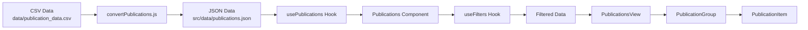
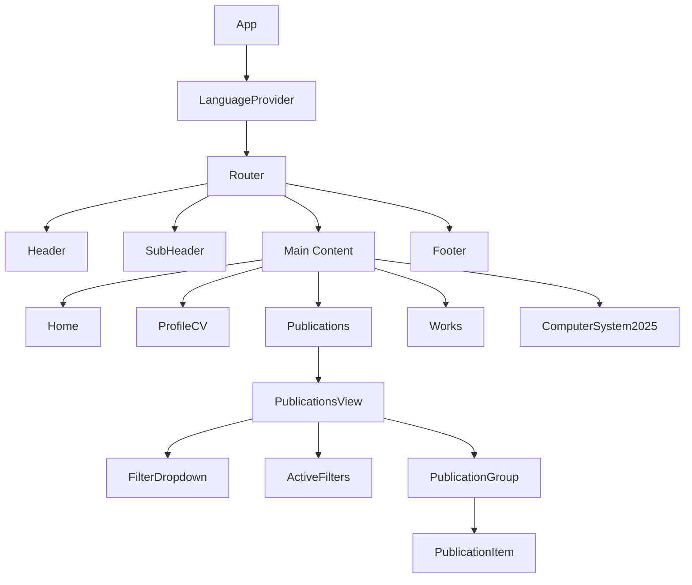
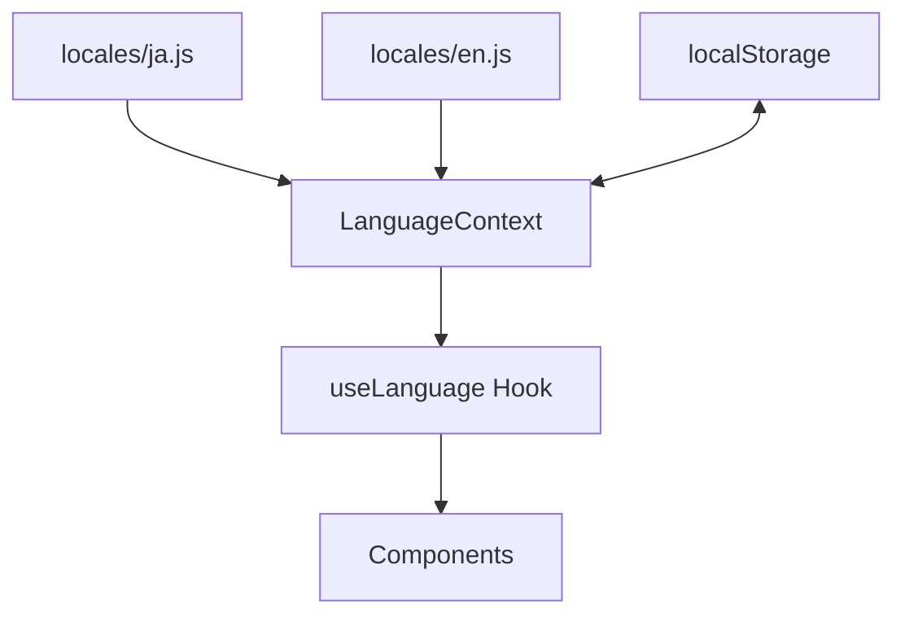

# プロジェクト構造

このドキュメントでは、my-web-pageプロジェクトのディレクトリ構造と各ファイルの役割について説明します。

## ディレクトリ構造

```
my-web-page/
├── data/                      # 元データ（CSV）
│   └── publication_data.csv   # 出版物の元データ（CSV形式）
├── docs/                      # ドキュメント
│   └── legacy/                # 旧ドキュメント
├── public/                    # 静的ファイル
│   ├── favicon.ico           # ファビコン
│   ├── index.html            # HTMLテンプレート
│   ├── manifest.json         # Webアプリマニフェスト
│   └── markdown/             # マークダウンコンテンツ
│       ├── home.md           # ホームページのコンテンツ
│       ├── profilecv.md      # プロフィール・CVページのコンテンツ
│       ├── en/               # 英語版マークダウン
│       │   ├── home.md       # 英語版ホームページ
│       │   ├── profilecv.md  # 英語版プロフィール・CV
│       │   ├── works.md      # 英語版業務ページ
│       │   └── works/        # 英語版業務詳細ページ
│       │       └── computer-system-2025.md # コンピュータシステム2025（英語）
│       └── ja/               # 日本語版マークダウン
│           ├── home.md       # 日本語版ホームページ
│           ├── profilecv.md  # 日本語版プロフィール・CV
│           ├── works.md      # 日本語版業務ページ
│           └── works/        # 日本語版業務詳細ページ
│               └── computer-system-2025.md # コンピュータシステム2025（日本語）
├── scripts/                   # ユーティリティスクリプト
│   └── convertPublications.js # CSVからJSONへの変換スクリプト
├── src/                       # ソースコード
│   ├── App.jsx               # アプリケーションのルートコンポーネント
│   ├── index.js              # エントリーポイント
│   ├── __tests__/            # テストファイル
│   ├── components/           # 再利用可能なコンポーネント
│   │   ├── Footer.jsx        # フッターコンポーネント
│   │   ├── Header.jsx        # ヘッダーコンポーネント
│   │   ├── SubHeader.jsx     # サブヘッダーコンポーネント
│   │   └── publications/     # 出版物関連のコンポーネント
│   ├── contexts/             # Reactコンテキスト
│   │   └── LanguageContext.js # 言語コンテキスト
│   ├── data/                 # 処理済みデータ（JSON）
│   │   └── publications.json # 変換された出版物データ
│   ├── hooks/                # カスタムフック
│   │   ├── useFilters.js     # フィルタリング機能のフック
│   │   └── usePublications.js # 出版物データ処理のフック
│   ├── locales/              # 多言語リソース
│   │   ├── en.js             # 英語リソース
│   │   ├── index.js          # リソースのエクスポート
│   │   └── ja.js             # 日本語リソース
│   ├── pages/                # ページコンポーネント
│   │   ├── Home.jsx          # ホームページ
│   │   ├── ProfileCV.jsx     # プロフィール・CVページ
│   │   ├── Publications.jsx  # 出版物ページ
│   │   ├── Works.jsx         # 業務ページ
│   │   └── ComputerSystem2025.jsx # コンピュータシステム2025ページ
│   ├── styles/               # スタイルシート
│   │   ├── styles.css        # グローバルスタイル
│   │   └── variables.css     # CSSカスタムプロパティ
│   └── utils/                # ユーティリティ関数
│       ├── csvToJson.js      # CSV→JSON変換ユーティリティ
│       └── markdownLoader.js  # マークダウン読み込みユーティリティ
├── .gitignore                # Gitの除外ファイル設定
├── jest.config.js            # Jestの設定
├── package.json              # npm設定と依存関係
└── README.md                 # プロジェクト概要
```

## 主要コンポーネントの説明

### アプリケーション構造

- **App.jsx**: アプリケーションのルートコンポーネント。ルーティング設定、レイアウト構造、グローバルプロバイダー（MantineProvider、LanguageProvider）を定義しています。
- **index.js**: Reactアプリケーションのエントリーポイント。

### ページコンポーネント

- **Home.jsx**: ホームページ。マークダウンコンテンツを読み込んで表示します。
- **ProfileCV.jsx**: プロフィールと履歴書のページ。マークダウンコンテンツを読み込んで表示します。
- **Publications.jsx**: 出版物一覧ページ。出版物データの取得、フィルタリング、並び替えの状態管理を行います。
- **Works.jsx**: 業務紹介ページ。マークダウンコンテンツを読み込んで表示します。
- **ComputerSystem2025.jsx**: コンピュータシステム2025の詳細ページ。マークダウンコンテンツを読み込んで表示します。

### 共通コンポーネント

- **Header.jsx**: サイト全体のヘッダー。ナビゲーションメニューと言語切り替えボタンを含みます。
- **SubHeader.jsx**: 各ページのタイトルを表示するベージュ帯のコンポーネント。
- **Footer.jsx**: サイト全体のフッター。著作権情報などを表示します。

### 出版物関連コンポーネント

- **PublicationsView.jsx**: 出版物一覧のUIコンポーネント。フィルターと並び替えのUIを提供します。
- **PublicationGroup.jsx**: 出版物をグループ化して表示するコンポーネント。
- **PublicationItem.jsx**: 個々の出版物項目を表示するコンポーネント。
- **FilterDropdown.jsx**: フィルタードロップダウンコンポーネント。
- **ActiveFilters.jsx**: 現在適用されているフィルターを表示するコンポーネント。

### コンテキストとフック

- **LanguageContext.js**: 言語設定を管理するコンテキスト。言語の切り替えと保存を担当します。
- **usePublications.js**: 出版物データの取得、整形、並び替え、グループ化を行うカスタムフック。
- **useFilters.js**: フィルタリング機能を提供するカスタムフック。

### ユーティリティ

- **csvToJson.js**: CSVファイルをJSONに変換するユーティリティ関数。
- **markdownLoader.js**: マークダウンファイルを読み込むユーティリティ関数。

## データフロー

以下の図は、出版物データの流れを示しています：



## コンポーネント階層

以下の図は、アプリケーションのコンポーネント階層を示しています：



## 多言語対応の構造

以下の図は、多言語対応の仕組みを示しています：



詳細な多言語対応の実装については、[多言語対応](./multilingual-support.md)のドキュメントを参照してください。